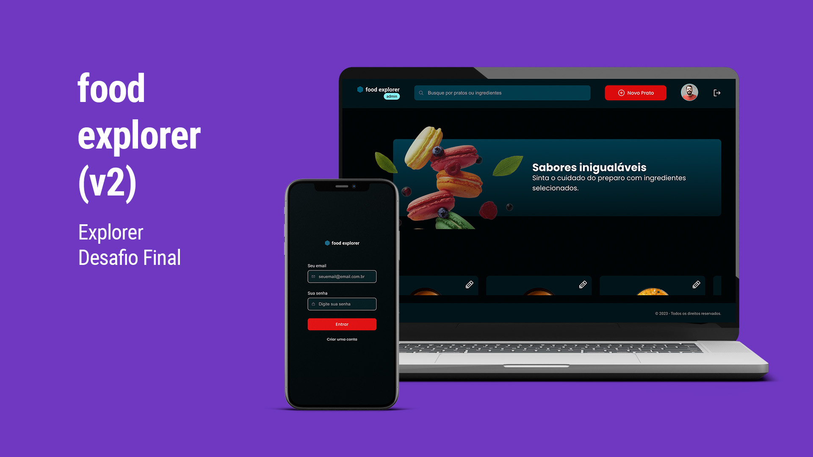

<h1 align="center">Curso Explorer - RocketSeat - Projeto Final - Food Explorer</h1>

Projeto desenvolvido ao final do curso Explorer da Rocketseat, de uma aplicação CRUD para gerenciamento de um restaurante fictício de delivery, com cadastro de usuário e login, cadastro, edição e exclusão de pratos e manipulação de banco de dados, em uma SPA (Single Page Application) construída com React.js e Node.js.

O FoodExplorer possui dois tipos de usuários, Admin e Customer, com regras definidas para cada um deles.

Veja o resultado <a href="" target="_blank">aqui.</a>

  <a href="#-tecnologias">Tecnologias</a>&nbsp;&nbsp;&nbsp;|&nbsp;&nbsp;&nbsp;
  <a href="#-projeto">Projeto</a>&nbsp;&nbsp;&nbsp;|&nbsp;&nbsp;&nbsp;
  <a href="#-layout">Layout</a>&nbsp;&nbsp;&nbsp;|&nbsp;&nbsp;&nbsp;
  <a href="#memo-licença">Licença</a>

  

 

  

## Tecnologias

Esse projeto foi desenvolvido com as seguintes tecnologias:

- Figma
- React.js
- Node.js
- HTML e CSS
- JavaScript
- Git e Github

## Projeto

Uma aplicação de ponta a ponta, em React.js e Node.js para cadastro de usuários e pratos para uma simulação de um restaurante que vende online para delivery. A aplicação permite o cadastro de novos usuários e login.

### Usuários Customer podem:

- Atualizar seu cadastro, trocar avatar, informações e senha.
- Visualizar os pratos, favoritar, mudar quantidades e adicionar aos pedidos.
- Revisar seus pedidos, adicionando ou retirando quantidades, ou removendo itens para finalizar e simular o pagamento dos pedidos.
- Visualizar seus pratos favoritos e seus pedidos.

### Usuários Admin podem:

- Atualizar seu cadastro, trocar avatar, informações e senha.
- Visualizar os pratos, criar novos pratos e editar pratos existentes.
- Listar todos os pedidos que existem e mudar seu status, indicando produção e entrega.

## Layout

Você pode visualizar o layout do projeto através [DESSE LINK](https://www.figma.com/community/file/1196874589259687769). É necessário ter conta no [Figma](https://figma.com) para acessá-lo.

## Licença

Esse projeto está sob a licença MIT.

---

Feito com ♥ by Rocketseat/[rafaverde](https://github.com/rafaverde) :wave: [Participe da nossa comunidade!](https://discord.gg/rocketseat)

#Rocketmovies #RocketSeat
